# 
 Setup of Docsify using podman

**Step:1**
Open Terminal in Ubuntu by pressing **Ctrl+alt+t** button combinations.

~~~
Ctrl+Alt+t
~~~

**Step :2**
 
~~~
sudo apt update
~~~

**sudo apt update** command is used in Debian-based Linux
distributions, such as Ubuntu, to update the package repository
information on your system.

~~~
sudo apt upgrade 
~~~

**sudo apt upgrade** command is used in Linux-based operating systems, such as Ubuntu, to update the installed packages on your system to their latest versions.

**Step :3** 

~~~
sudo apt install podman
~~~

**sudo apt install podman** is used to install the Podman container management tool on a Debian-based Linux system using the Advanced Package Tool (APT).

**Step :4** 

~~~
podman version
~~~

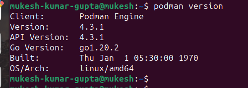

**Step:5**

~~~
systemctl status podman
~~~

**systemctl status podman** command is used to check the status of the Podman service on a Linux system.

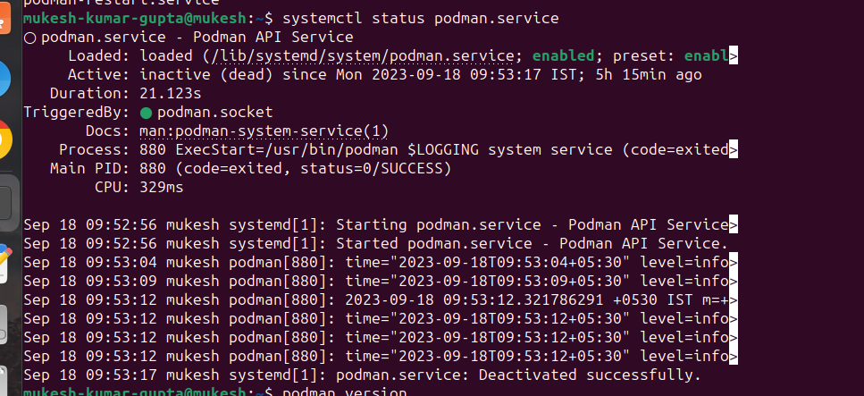

**Step:6**

~~~
mkdir docs
~~~

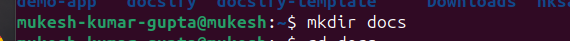

**Step:7**

~~~
cd docs
~~~

**Step:8**

Command for Create File.

~~~
touch README.md
touch index.html
touch Dockerfile
~~~

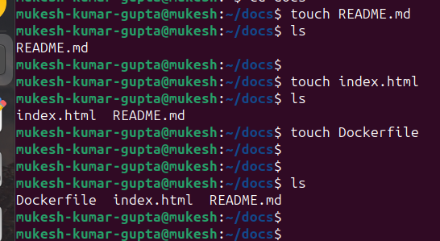

**Step:9**

~~~
vim index.html
~~~

**vim index.html** is used to open or edit a file named index.html using the Vim text editor. 

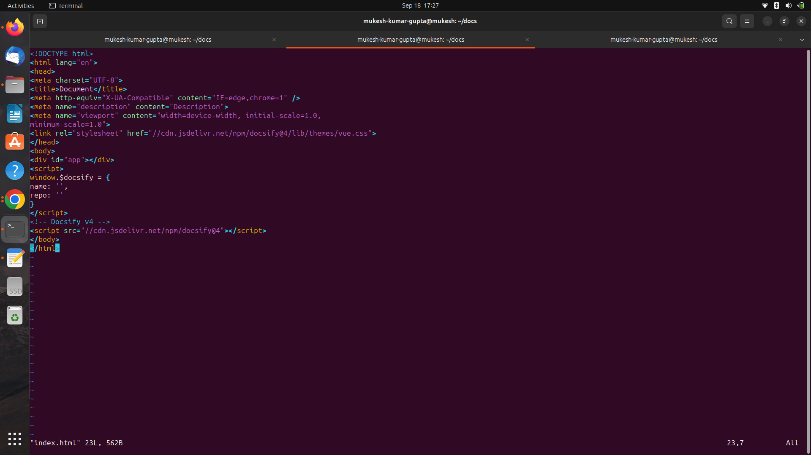

**Step:10**

~~~
vim Dockerfile
~~~

**vim Dockerfile** command is a way to open a file named Dockerfile for editing using the Vim text editor. 

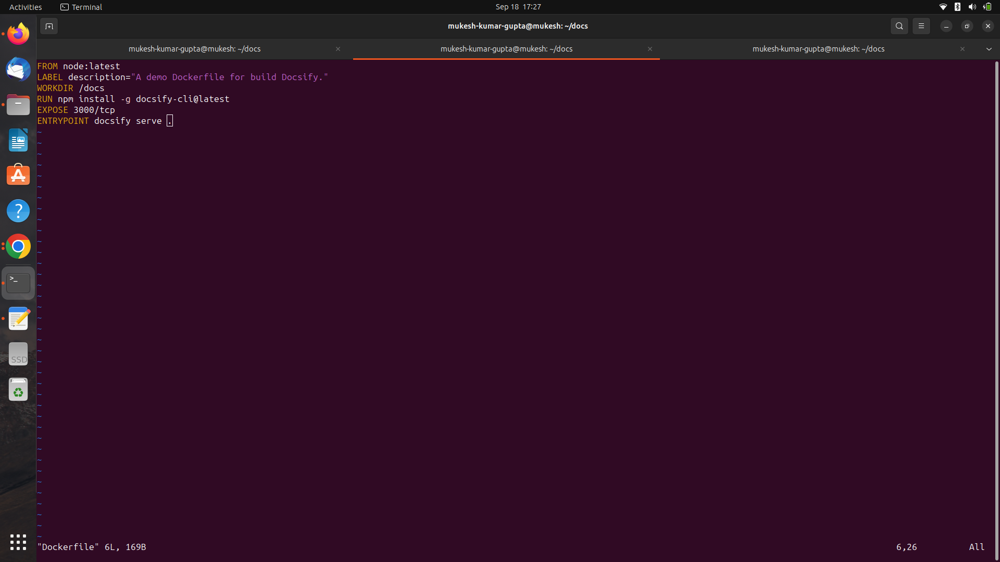

**Step:11**

~~~
podman build -f Dockerfile -t docsify/demo images.
~~~

**podman build -f Dockerfile -t docsify/demo images** is used to build a container image using Podman. Let's break down the command

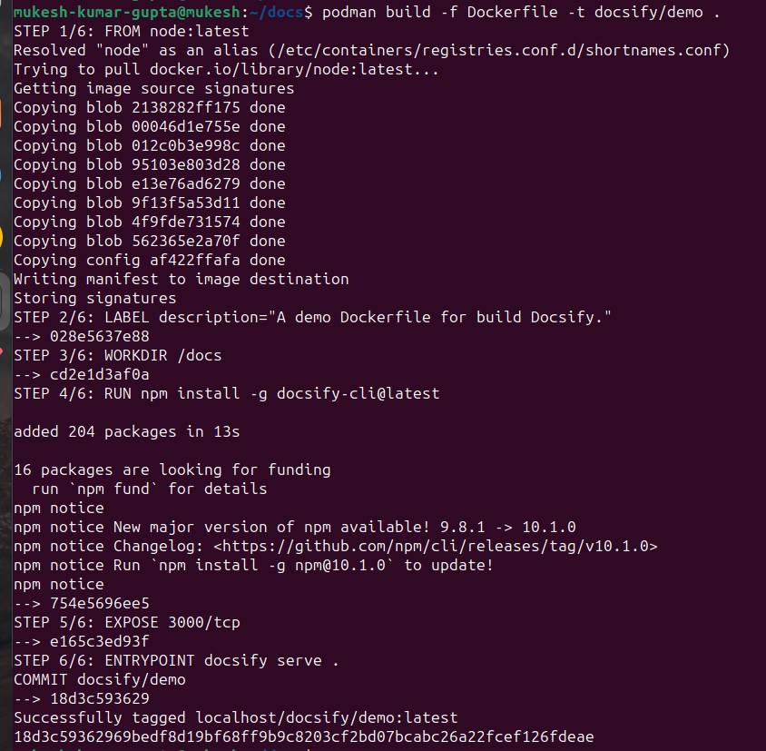

**podman build** This is the command for building container images using Podman, 

**-f Dockerfile** This flag specifies the name of the Dockerfile to use for building the image. The Dockerfile is a script that contains a series of instructions to define the image. In this case, it's named Dockerfile.

**-t docsify/demo** flag names the image as docsify/demo, where "docsify" is the repository name and "demo" is the tag. 

**images:** This is the context directory or build context. It specifies the location where the build process will look for the necessary files to build the image. 

**Step:12**

~~~
podman images
~~~

**podman images** is used to list the container images that are available on your system when using Podman.

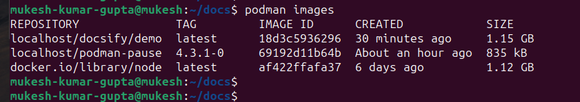

**Step:13**

~~~
podman run -itp 3001:3000 --name-docsify -v  /home/mukesh-kumar-gupta/docs:/docs docsify demo
~~~

**podman run -itp 3001:3000 --name-docsify -v /home/mukesh-kumar-gupta/docs:/docs docsify demo,** is used to run a containerized instance of Docsify, which is a lightweight documentation generator.

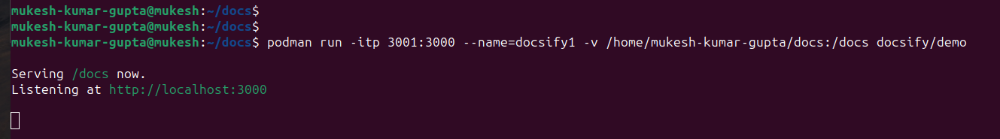
 
**podman run:** This is the command to run a container using Podman, which is a container management tool similar to Docker.

**-itp 3001:3000** These are flags used to specify options for running the container:

**-i** Keep STDIN open even if not attached. This allows you to interact with the container's console if needed.

**-t** Allocate a pseudo-TTY. This simulates a terminal device for the container.

**-p** 3001:3000: This maps port 3000 from the container to port 3001 on the host. This allows you to access the Docsify application running inside the container using http://localhost:3001.

**--name-docsify** This gives a name (docsify) to the running container, allowing you to easily refer to it in the future.

**-v /home/mukesh-kumar-gupta/docs:/docs** This mounts the directory /home/mukesh-kumar-gupta/docs on the host to /docs inside the container. This is a way to share files or data between the host and the container. In this case, it's likely that the directory contains the documentation files that Docsify will use to generate the documentation site.

**docsify demo** This is the command that will be executed inside the container. docsify demo starts a local server to preview the documentation site.

**Step:14**

~~~
podman ps 
~~~

**podman ps** command is used in Linux-based systems to display information about running containers and pods managed by Podman.

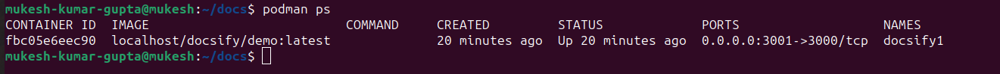

**Step:15**

Run the docsify on browser.

~~~
http://localhost:3001:3000
~~~

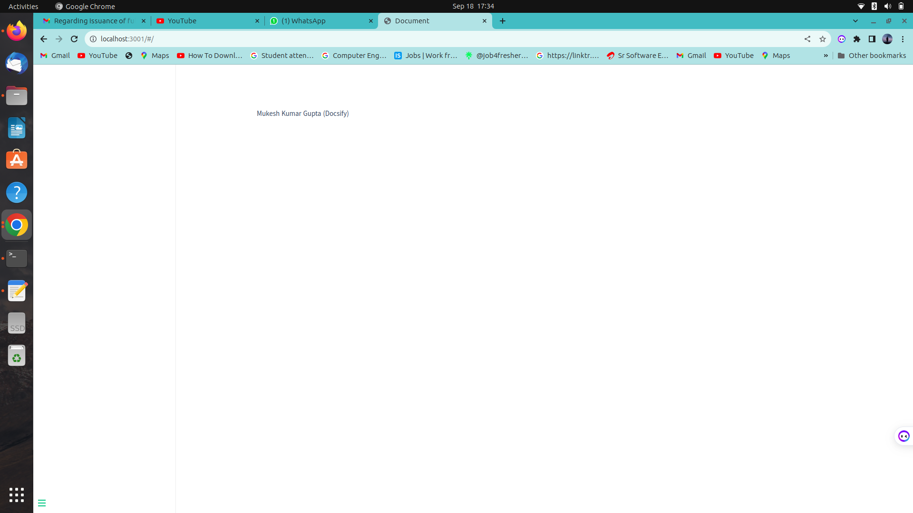